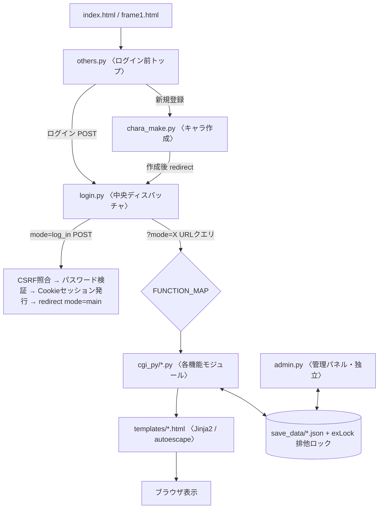
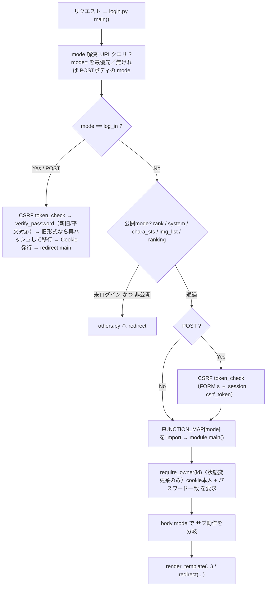
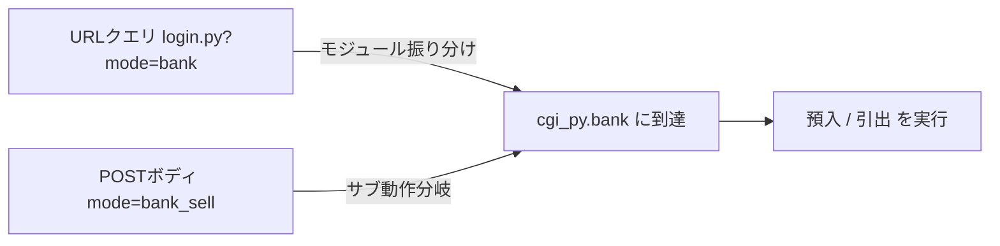
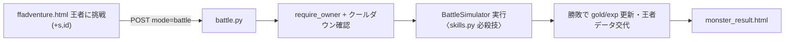
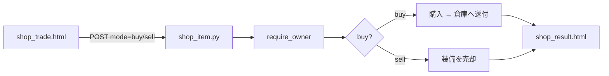
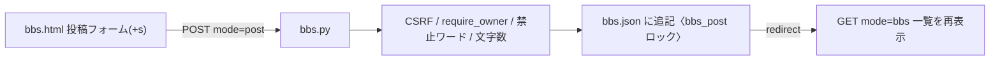

# FFA改 Vips — ルーティング / コマンドフロー 保守ドキュメント

各ページ・コマンドが `login.py` の中央ディスパッチャからどのモジュール・テンプレートへ流れるかを追うための開発者向けマップ。ソースコード（`login.py` の `FUNCTION_MAP` と各モジュール）から抽出した実データに基づく。

> mermaid 図は GitHub / VS Code(Markdown Preview Mermaid拡張) 等で描画されます。

---

## ① 全体構成

エントリポイントは4つ。実処理はすべて `login.py` に集約され、`FUNCTION_MAP` が `cgi_py/*.py` の各モジュールへ振り分ける。データは `save_data/*.json` にファイルロック付きで読み書きする（DBなし）。

---

## ② リクエスト処理のライフサイクル

1リクエストが `login.py main()` に入ってから描画されるまでの共通パイプライン。認証・CSRF・認可（IDOR対策）のゲートを通過する。

**ゲートの意味**
1. 未ログインで非公開modeなら `others.py` へリダイレクト。
2. POST は必ず **CSRF** 照合（ワンタイムトークン `s`）。
3. 状態変更系は `require_owner` で「他人の `?id=` による操作（IDOR）」を遮断。

---

## ③ 2層の `mode` 解決（このシステムの肝）

- **URLクエリの `mode` でモジュールを決定**
- **POSTボディの `mode` でモジュール内のサブ動作を分岐**
- `common.decode_params()` は GET+POST をマージし **POST 優先**

例: フォームは `action="login.py?mode=bank"`（振り分け）＋ hidden `<input name="mode" value="bank_sell">`（サブ動作）。config の `*_script` エイリアスはこの「`?mode=` 付き」を前提にしている。

---

## ④ ルーティング一覧表

クエリ mode → モジュール → 主なテンプレート → body mode（サブ動作）→ 認可レベル。

**認可の凡例:** 🟢 公開（未ログイン可） / 🔵 ログイン閲覧（読み取り専用） / 🟡 本人のみ（状態変更・`require_owner`） / 🔴 管理者（管理PW必須）

### メイン・プロフィール
| ページ / コマンド | module | 主なテンプレート | body mode | 認可 |
|---|---|---|---|---|
| メイン画面(街) | `ffadventure` | ffadventure.html | — | 🟡 本人 |
| 成長・設定 | `sts` | sts.html / sts_result.html | `st_buy` | 🟡 本人 |
| 作戦変更 | `tac_change` | tac_change.html / tac_result.html | `senjutu_henkou` | 🟡 本人 |
| 転職神殿 | `tensyoku` | tensyoku.html / tensyoku_result.html | `tensyoku_change` | 🟡 本人 |
| パスワード変更 | `passchange` | passchange.html / _done / _set_done | `passset` / `passchan` | 🟡 本人 |

### ショップ・所持品
| ページ / コマンド | module | 主なテンプレート | body mode | 認可 |
|---|---|---|---|---|
| 宿屋 | `shop` | shop.html | （`yado` で入場） | 🟡 本人 |
| 武器屋 | `shop_item` | shop_trade.html / shop_result.html | `buy` / `sell` | 🟡 本人 |
| 防具屋 | `shop_def` | shop_trade.html / shop_result.html | `buy` / `sell` | 🟡 本人 |
| 装飾品店 | `shop_acs` | shop_trade.html / shop_result.html | `buy` / `sell` | 🟡 本人 |
| 銀行 | `bank` | bank.html / bank_result.html | `bank_sell` / `bank_buy` | 🟡 本人 |
| アイテム倉庫 | `souko` | souko.html | item/def/acs × soubi/hazusi/delete | 🟡 本人 |

### 戦闘
| ページ / コマンド | module | 主なテンプレート | body mode | 認可 |
|---|---|---|---|---|
| 王者に挑戦 | `battle` | monster_result.html | — | 🟡 本人 |
| 修行 / 幻影 / 異世界 | `monster` | monster_result.html | `monster` / `genei` / `isekiai` | 🟡 本人 |
| 伝説の戦い | `legend` | monster_result.html / legend_error.html | `boss` | 🟡 本人 |
| 天下一武道会 | `tenka` | tenka.html / _error / _result | `battle` | 🟡 本人 |
| 道場(模擬戦) | `select_battle` | select_battle.html / monster_result.html | `log_in` / `sentaku` / `battle` | 🟡 本人 |

### チョコボ
| ページ / コマンド | module | 主なテンプレート | body mode | 認可 |
|---|---|---|---|---|
| チョコボ牧場 | `chocofarm` | chocofarm.html | （表示ハブ） | 🟡 本人 |
| 森(捕獲/配合/命名/引退/宿) | `morifarm` | morifarm.html | `choco_shop` / `_shopb` / `_buy` / `_buyb` / `_sell` / `_name` / `yadoya` | 🟡 本人 |
| 訓練 | `ctrain` | ctrain.html | `race0`〜`race6` | 🟡 本人 |
| レース | `crace` | crace.html | `race0`〜`race8` / `race_dendo` | 🟡 本人 |
| 王者決定戦 | `farmrace` | farmrace.html | — | 🟡 本人 |
| 殿堂 | `dendo` | dendo.html | `dendo`(登録) / `list`(閲覧) | 🟡 本人 |
| チョコボランキング | `chocorank` | chocorank.html | `ranking` | 🔵 閲覧 |

### 交流
| ページ / コマンド | module | 主なテンプレート | body mode | 認可 |
|---|---|---|---|---|
| 郵便局 | `post_message` | post_message.html ほか7枚 | `message` / `all_list` / `ban` / `ban_do` / `friend` / `limit` / `limit_do` / `res` | 🟡 本人 |
| 掲示板(BBS) | `bbs` | bbs.html | `post` → redirect(PRG) | 🟡 本人 |

### 閲覧・公開
| ページ / コマンド | module | 主なテンプレート | body mode | 認可 |
|---|---|---|---|---|
| 英雄ランキング | `rank` | rank.html | — | 🟢 公開 |
| 登録者一覧 / 他人ステータス / アイコン一覧 | `system` | system_ranking / _chara_sts / _img_list | `ranking` / `chara_sts` / `img_list` | 🟢 公開 |

### 管理（別エントリ）
| ページ / コマンド | module | 主なテンプレート | body mode | 認可 |
|---|---|---|---|---|
| 管理パネル | `admin.py` | admin.html | `kanri_top` / `kanri_all` / `data` / `save` / `del_chara` / `del_noplay` | 🔴 管理PW |

**補足:** `save` / `del_chara` / `del_noplay` は破壊的操作のため `admin.py` 側で `token_check`（CSRF）を追加済み。閲覧系（公開）は他人の `?id=` でも参照可能（設計どおり）で、状態変更系のみ本人に限定している。

---

## ⑤ 代表的なコマンドフロー

### 対人戦（王者挑戦） `mode=battle`

### ショップ購入・売却 `mode=shop_item`

### 掲示板 投稿（PRGパターン） `mode=bbs`

---

*FFA改 Vips Ver 3.00 — ルーティング保守ドキュメント / ソース抽出ベース*
